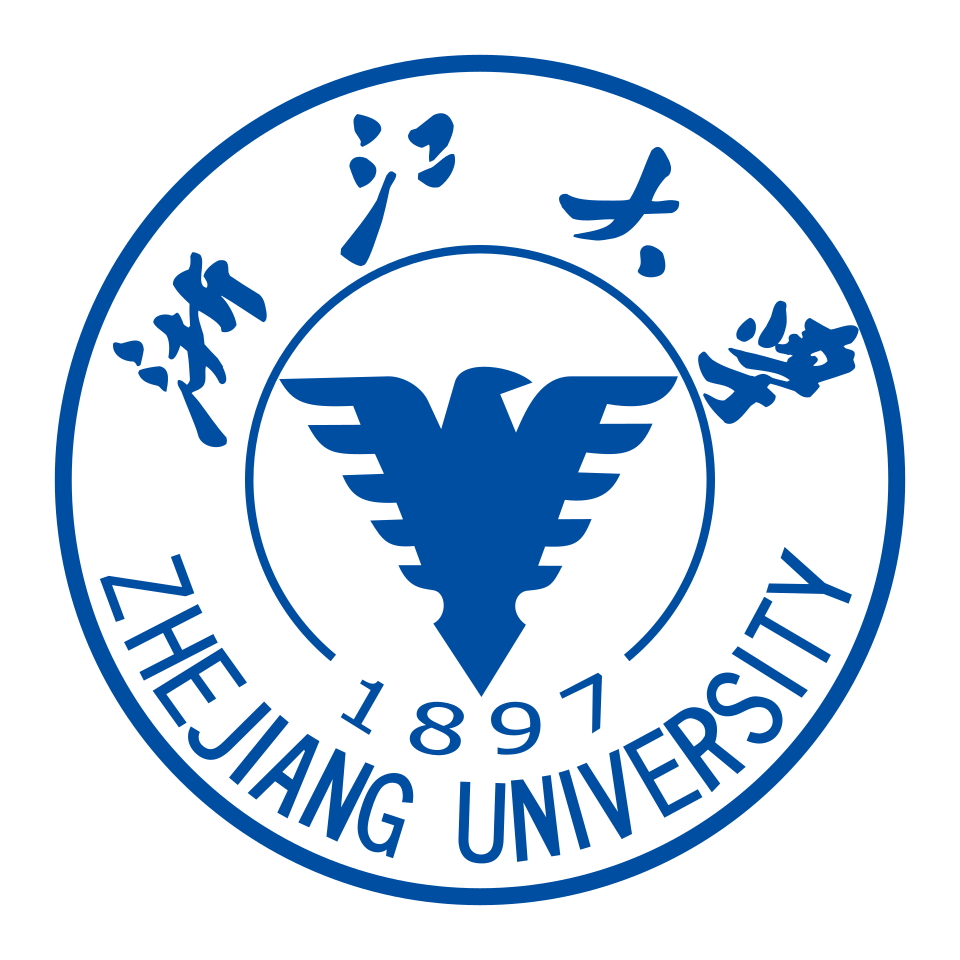
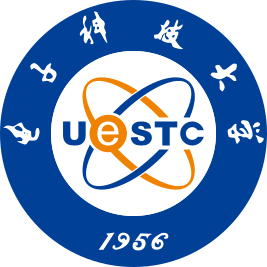

I am currently an Assistant Professor at [School of Software Technology, Zhejiang University](http://www.cst.zju.edu.cn/). I received the Ph.D. degree from [Nanyang Technological University](https://www.ntu.edu.sg/) (NTU), Singapore, in 2025. Before that, I received a Bachelor’s degree from [University of Electronic Science and Technology of China](https://www.uestc.edu.cn/), China, in 2020. Currently, my research interests focus on **Agent OS** and the **Internet of Agents**, aiming to explore the integration of agents into operating systems and networks to enable autonomous collaboration, resource management, and optimized service delivery.

**Email**: chang.liu@zju.edu.cn

# News

  

    <a class="news-cfp" href="https://supperannoy.github.io/rems2026/">[Call for Papers!]</a>
  

  

    We are organizing the <strong>Workshop on Reliable and Efficient Multi-agent Services</strong> at <a href="https://services.conferences.computer.org/2026/icws/"><strong>ICWS 2026</strong></a>,
    to be held in Sydney, Australia, on July 13–18, 2026. Paper submissions are now invited! Please check the <a href="https://supperannoy.github.io/rems2026/">CFP</a> for more details.
  

---

# Work Experience

    

        
    

    

        <b>Zhejiang University（浙江大学）</b>  
        Jan. 2026 - Now   
        Assistant Professor, School of Software Technology
<!--         Also affiliated with <a href="https://www.ntu.edu.sg/erian">Energy Research Institute @ NTU</a> -->
    

---

    

        
    

    

        <b>Nanyang Technological University</b>  
        Nov. 2024 - Jan. 2026   
        Research Fellow, College of Computing and Data Science
<!--         Also affiliated with <a href="https://www.ntu.edu.sg/erian">Energy Research Institute @ NTU</a> -->
    

<!--
# Education 

    

        
    

    

        <b>Nanyang Technological University</b>  
        Aug. 2020 - Jul. 2025   
        Ph.D. in Computer Science & Engineering
    

---

    

        
    

    

        <b>University of Electronic Science and Technology of China</b>  
        Sep. 2016 - Jun. 2020  
        B.E. in Software Engineering (Network Security Engineering)
    

-->

<!--
&nbsp;

# Selected Awards
+ IEEE INFOCOM 2024 Student Travel Grant, 2024
+ ACM/IEEE SEC 2022 Student Travel Grant, 2022
+ IEEE/ACM BDCAT Best Paper Award, 2022
+ NTU Full-Time PhD Scholarship, 2020
+ Third-prize in Undergraduate Electronics Design Contest of Sichuan Province, 2018
+ Outstanding Student Scholarship of UESTC, 2017 & 2018
-->

