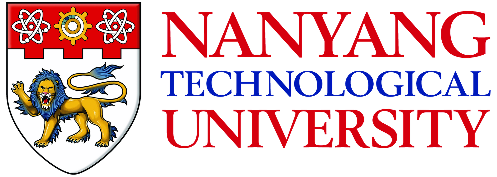

I received the Ph.D. degree from [Nanyang Technological University](https://www.ntu.edu.sg/) (NTU), Singapore, in 2025. My research focuses on interdisciplinary areas of **AI** and **communication networks**, with a specific emphasis on **mobile edge computing**. Before that, I received a Bachelor’s degree from [University of Electronic Science and Technology of China](https://www.uestc.edu.cn/), China, in 2020.

**Email**: liuc0063@e.ntu.edu.sg

# Education 

    

        
    

    

        <b>Nanyang Technological University</b>  
        Aug. 2020 - 2025   
        Ph.D. student at <a href="https://www.ntu.edu.sg/computing">College of Computing and Data Science</a>
<!--         Also affiliated with <a href="https://www.ntu.edu.sg/erian">Energy Research Institute @ NTU</a> -->
    

---

    

        
    

    

        <b>University of Electronic Science and Technology of China</b>  
        Sep. 2016 - Jun. 2020  
        B.E. in Software Engineering (Network Security Engineering)
    

&nbsp;

# Selected Awards
+ IEEE INFOCOM 2024 Student Travel Grant, 2024
+ ACM/IEEE SEC 2022 Student Travel Grant, 2022
+ IEEE/ACM BDCAT Best Paper Award, 2022
+ NTU Full-Time PhD Scholarship, 2020
+ Third-prize in Undergraduate Electronics Design Contest of Sichuan Province, 2018
+ Outstanding Student Scholarship of UESTC, 2017 & 2018
  

